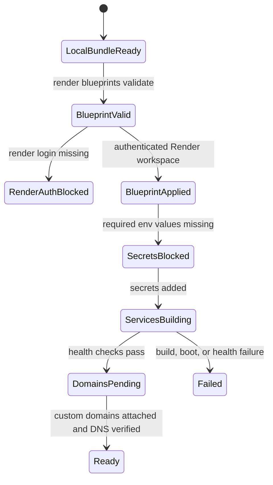

# Render OpenChamber Deployment

## Current State

This repository builds one OpenChamber Docker image. The image already installs `opencode-ai`; this deployment layer adds persistent runtime bootstrap for Render, OpenCode provider defaults, MCP search connectors, Russian workspace instructions, and the requested skill seed set.

Render CLI is installed locally, but the workstation is not authenticated to Render yet. Secrets and custom domains are intentionally not committed.

## Target State

Ten Render web services run the same OpenChamber image:

- `openchamber-01` through `openchamber-10`
- one persistent disk per service mounted at `/home/openchamber/data`
- one default workspace per service: `workspace-01` through `workspace-10`
- OpenCode default model: `zed/deepseek`
- OpenAI-compatible base URL: `https://api.zed.md/v1`
- MCP: `firecrawl` and `exa`
- Russian `AGENTS.md` and `README.md` in every seeded workspace
- UI password enforced before any public service starts

## Gap / Transformation

Render disks must not mount over `/home/openchamber`, because that path contains the built app. The blueprint mounts disks at `/home/openchamber/data`, then `bootstrap.sh` symlinks OpenChamber/OpenCode config, cache, SSH, and workspace paths into that persistent root.

OpenCode keys are supplied only as environment variables:

- `OPENCHAMBER_UI_PASSWORD`
- `ZED_API_KEY`
- `FIRECRAWL_API_KEY`
- `EXA_API_KEY`

`render.yaml` marks these with `sync: false`, so Render stores them as secrets and they are not written to git.

## State Diagram



## Recommended Path

Use the 10-service Render Blueprint.

Rejected alternatives:

- One Render service with 10 folders: cheaper, but not 10 independent runtimes.
- One service plus OpenChamber project switching: simpler, but restarts/logs/secrets/storage are shared.
- Ten manual Render services: works once, but drift is likely.

The blueprint path costs more, but it matches the request for 10 identical runtimes and gives isolated logs, restarts, disks, and domain bindings.

## Apply

1. Push this repository to the GitHub repository Render should build from.
2. Authenticate the Render CLI:

```bash
render login
```

3. Validate the blueprint:

```bash
render blueprints validate ./render.yaml
```

4. Create or sync the Blueprint in Render from this repository.
5. Add the secret env vars in Render for every service or via a Render Environment Group if you prefer to centralize them.
6. Attach domains, for example:

```text
chamber-01.example.com -> openchamber-01
chamber-02.example.com -> openchamber-02
...
chamber-10.example.com -> openchamber-10
```

7. Verify each runtime:

```bash
curl -fsS https://chamber-01.example.com/health
curl -fsS https://chamber-10.example.com/health
```

## Skills

`bootstrap.sh` always creates OpenCode adapter skills for:

- `superpowers`
- `openagent`
- `mattpocock-skills`
- `gpt-tasteskill`
- `grill-me`
- `grill-with-docs`
- `open-dynamic-workflows`
- `acpx-agent-delegation`
- `understand-anything`
- `graphify`
- `activegraph`

By default it also best-effort clones known upstream GitHub repositories and copies any discovered `SKILL.md` directories into `~/.config/opencode/skills`. If an upstream repository is unavailable or does not contain a portable `SKILL.md`, the adapter remains installed and startup continues.

Set `OPENCHAMBER_INSTALL_UPSTREAM_SKILLS=false` to disable upstream cloning.

## Verification Proof

Local proof before Render auth:

- `sh -n scripts/docker-entrypoint.sh`
- `sh -n deploy/render/bootstrap.sh`
- bootstrap smoke test with a temporary home/data root
- `render blueprints validate ./render.yaml` after `render login`

Render proof after auth/secrets/domain:

- all 10 services build successfully
- `/health` returns success on each service
- UI requires `OPENCHAMBER_UI_PASSWORD`
- OpenCode starts in the expected `workspace-NN`
- `~/.config/opencode/opencode.json` contains `zed/deepseek`, Firecrawl MCP, and Exa MCP
